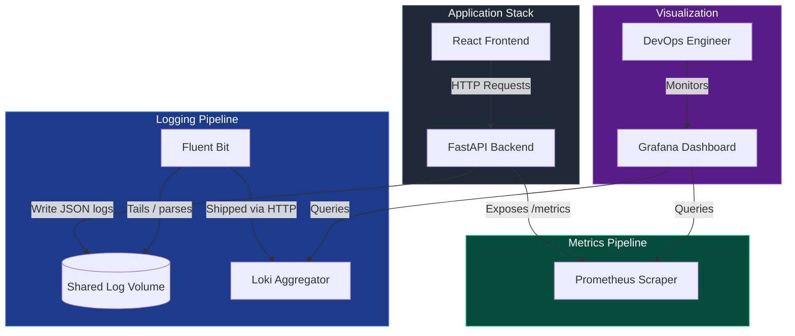

# Observability & Log Monitoring System Architecture

This document provides a technical walkthrough of the logging and metrics architecture implemented in this starter project. The design is modular, cloud-agnostic, and conforms to industry best-practices for cloud-native applications.

---

## Architecture Overview

The system consists of a microservices stack (Frontend + Backend) coupled with a modern open-source observability pipeline:

---

## 1. Logging Pipeline

Traditional logging writes raw text (e.g. log lines) to `stdout` which is difficult for automated log parsers to analyze. This system uses **Structured JSON Logging**.

### Step 1.1: Log Generation
The FastAPI backend utilizes a custom python logger formatted by `logging_config.py`. It outputs every log line as a single line JSON string with standard metadata:
- `timestamp`: ISO-8601 UTC time.
- `level`: Log level severity (INFO, WARNING, ERROR).
- `message`: Text description.
- `correlation_id`: A UUID linking API requests to backend processing, enabling end-to-end tracing.
- `exception`: Stack traces (for errors).

### Step 1.2: Log Gathering
In our local Docker setup, the backend writes to a shared volume path `/app/logs/app.log`. In a production Kubernetes system, this is usually scraped from container stdout/stderr path `/var/log/pods`.

### Step 1.3: Log Shipper (Fluent Bit)
[Fluent Bit](https://fluentbit.io/) is chosen as our log shipper. It is a highly optimized C application, which uses minimal CPU/Memory compared to Logstash or Fluentd.
- **Input**: The `tail` plugin reads logs from `/var/log/app/*.log`.
- **Parser**: The `json` parser parses the JSON structure, allowing downstream query engines to filter on individual attributes.
- **Output**: The `loki` output plugin posts these logs to Loki's REST API endpoint `http://loki:3100/loki/api/v1/push`.

### Step 1.4: Storage & Visualization
[Loki](https://grafana.com/oss/loki/) indexes labels (such as `job="log-monitoring-backend"`) while storing compressed log chunks. Grafana queries Loki via LogQL (Log Query Language) to display log streams in real-time.

---

## 2. Metrics Pipeline

Metrics provide numerical time-series data describing system behavior (e.g., CPU, RAM, request counts, response latency).

### Step 2.1: Instrumenting the Application
We use `prometheus-fastapi-instrumentator` in our FastAPI application. During bootstrap, it hooks into the routing framework, collecting metrics for:
- Request counts (`http_requests_total`) partitioned by HTTP Status Code, HTTP method, and path.
- Request durations (`http_request_duration_seconds`).

These metrics are exposed at a dedicated REST endpoint: `/metrics`.

### Step 2.2: Scrape Engine (Prometheus)
[Prometheus](https://prometheus.io/) polls (scrapes) the `/metrics` endpoint on the `backend` container every 5 seconds. It aggregates these metrics into a local time-series database.

### Step 2.3: Dashboard Visualization
[Grafana](https://grafana.com/) queries Prometheus using PromQL (Prometheus Query Language) to compute active rates, latency statistics, and error distributions.

---

## 3. High Availability & Kubernetes

In Kubernetes:
- Both **frontend** and **backend** run with a replica count of `2` inside the `monitoring-system` namespace.
- **Liveness/Readiness Probes** monitor container statuses. If a backend instance becomes slow or deadlocks, Kubernetes removes it from the Service endpoint routing table and automatically spins up a fresh container.
- ConfigMaps house variables dynamically, allowing environment decoupling (dev, staging, prod) without rebuilds.
