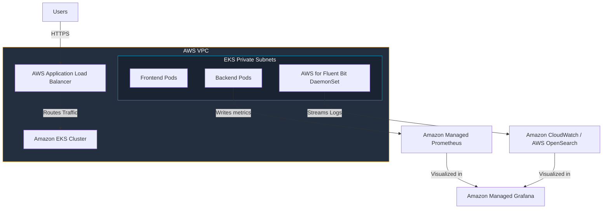

# Production AWS Deployment Plan

This guide outlines a production-grade deployment architecture for migrating the log monitoring system to Amazon Web Services (AWS). It leverages AWS managed services to ensure security, high availability, and scalability.

---

## Target Production Architecture

The AWS target deployment utilizes a managed Kubernetes service (EKS) and managed monitoring services:



---

## 1. Container Registry: Amazon ECR

Instead of local Docker builds, container images are stored in **Amazon Elastic Container Registry (ECR)**.

### Actions:
1. Create private ECR repositories:
   ```bash
   aws ecr create-repository --repository-name log-monitoring-backend
   aws ecr create-repository --repository-name log-monitoring-frontend
   ```
2. In the GitHub Actions CI/CD workflow, integrate AWS Authentication and push images to ECR:
   ```yaml
   - name: Configure AWS credentials
     uses: aws-actions/configure-aws-credentials@v4
     with:
       role-to-assume: arn:aws:iam::123456789012:role/GithubActionsECRRole
       aws-region: us-east-1

   - name: Login to Amazon ECR
     id: login-ecr
     uses: aws-actions/amazon-ecr-login@v2
   ```

---

## 2. Container Orchestration: Amazon EKS

We deploy the application to **Amazon Elastic Kubernetes Service (EKS)**.

### Infrastructure Provisioning:
Use Terraform or `eksctl` to provision the EKS Cluster with private worker nodes across multiple Availability Zones (AZs) for high availability.

```bash
eksctl create cluster \
  --name eks-monitoring-cluster \
  --region us-east-1 \
  --nodegroup-name standard-workers \
  --node-type t3.medium \
  --nodes 3 \
  --nodes-min 2 \
  --nodes-max 4 \
  --managed
```

### Ingress & ALB Integration:
To route traffic securely from the internet, install the **AWS Load Balancer Controller** in EKS.
- The Kubernetes service type for the frontend is kept as `ClusterIP`.
- We add an `Ingress` resource utilizing the `alb` class which provisions an external AWS Application Load Balancer (ALB).
- Integrate **AWS Certificate Manager (ACM)** for TLS termination.

---

## 3. Production Monitoring: Amazon Managed Prometheus (AMP)

Instead of running self-managed Prometheus pods inside Kubernetes which consume cluster memory and storage, we utilize **Amazon Managed Prometheus (AMP)**.

### Configuration Steps:
1. Create an AMP workspace:
   ```bash
   aws amp create-workspace --alias monitoring-workspace
   ```
2. Configure a **Prometheus Agent** (via Grafana Agent or standard Prometheus Agent mode) running inside EKS.
3. Configure the agent to remote-write metrics to the AMP workspace endpoint:
   ```yaml
   remote_write:
     - url: https://aps-workspaces.us-east-1.amazonaws.com/workspaces/ws-xxx/api/v1/remote_write
       sigv4:
         region: us-east-1
   ```

---

## 4. Production Logging: Fluent Bit to CloudWatch / OpenSearch

In EKS, containers write logs directly to stdout/stderr. These are written to host directories `/var/log/pods/`. We run **AWS for Fluent Bit** as a `DaemonSet` on every node in the cluster.

### AWS-optimized Fluent Bit Config:
Fluent Bit sends parsed JSON logs to **Amazon CloudWatch Logs** or **Amazon OpenSearch Service**.

Using IAM Roles for Service Accounts (IRSA), Fluent Bit inherits permissions using an AWS IAM role:
```yaml
# Service Account for Fluent Bit
apiVersion: v1
kind: ServiceAccount
metadata:
  name: fluent-bit
  namespace: monitoring-system
  annotations:
    eks.amazonaws.com/role-arn: arn:aws:iam::123456789012:role/EKS-FluentBit-CloudWatch-Role
```

In the output plugin of `/etc/fluent-bit/fluent-bit.conf`, ship to CloudWatch:
```ini
[OUTPUT]
    Name                cloudwatch_logs
    Match               *
    region              us-east-1
    log_group_name      /eks/monitoring-cluster/containers
    log_stream_prefix   app-
    auto_create_group   true
```

---

## 5. Visualizations: Amazon Managed Grafana (AMG)

We configure **Amazon Managed Grafana (AMG)**, which connects seamlessly to AWS Managed Prometheus and CloudWatch.
- Access is restricted using **AWS IAM Identity Center** (formerly AWS SSO) or SAML 2.0.
- Data sources are provisioned directly via AWS Console or Terraform.
- Imported Dashboards will use IAM role authorization to query logs and metrics, avoiding standard password authentication vulnerabilities.
